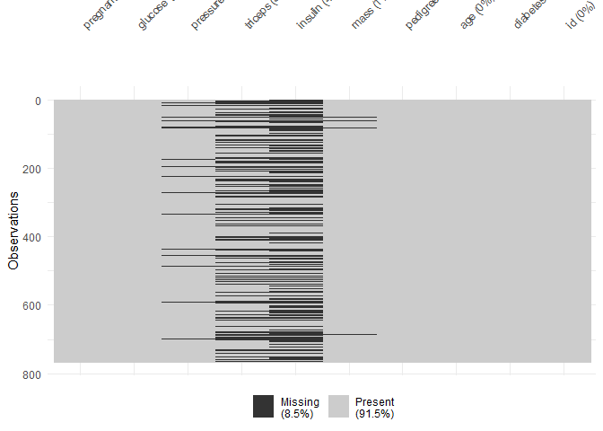
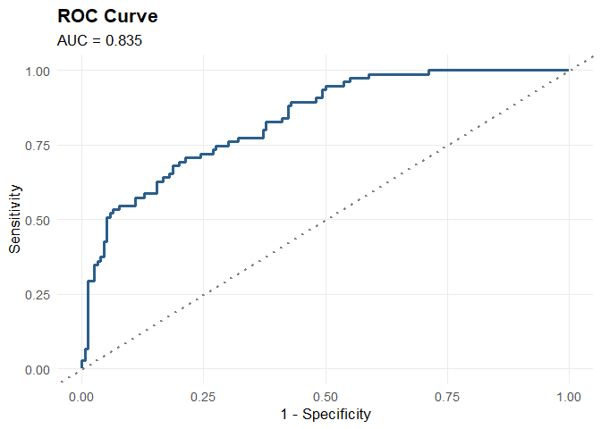

# triageR

# triageR 

<!-- badges: start -->

<!-- badges: end -->

**triageR** provides a streamlined, reproducible workflow for building,
validating, and reporting clinical prediction models in R. It combines
standard machine learning tools with an optional AI agent that
recommends appropriate statistical methods, runs automated sensitivity
analyses, and flags common clinical modelling pitfalls. Reports are
generated in a format aligned with TRIPOD+AI reporting guidance, to
support reproducible, guideline-conscious research.

## Why triageR?

Most R machine learning tooling (`tidymodels`, `mlr3`, `caret`) is
general-purpose. Clinical researchers are left to manually stitch
together model fitting, validation, sensitivity analysis,
explainability, and TRIPOD-compliant reporting across many separate
packages. triageR brings these into one coherent workflow, with
clinically-aware safeguards built in — such as warning when validation
is performed only on training data, and flagging low events-per-variable
ratios before you finalize a model.

The AI agent layer is entirely **optional** — every core function works
without any LLM/API key. The agent adds method recommendations, plain
language pipeline review summaries, and assists with sensitivity
analysis interpretation, but is never required to fit, validate, or
explain a model.

## Installation

You can install the development version of triageR from
[GitHub](https://github.com/) with:

``` r
# install.packages("devtools")
devtools::install_github("DevWebWacky/triageR")
```

## Example workflow

## Example workflow

This example uses the PIMA Indians Diabetes dataset to demonstrate the
full triageR pipeline, from raw data to a validated, explainable model.

``` r
library(triageR)
library(mlbench)

data(PimaIndiansDiabetes)
pima <- PimaIndiansDiabetes
pima$id <- seq_len(nrow(pima))

# convert physiologically impossible zeros to real missing values
pima$glucose[pima$glucose == 0]   <- NA
pima$pressure[pima$pressure == 0] <- NA
pima$triceps[pima$triceps == 0]   <- NA
pima$insulin[pima$insulin == 0]   <- NA
pima$mass[pima$mass == 0]         <- NA

# 1. Load and standardize
pima_loaded <- tr_load_clinical(pima, id_col = "id")

# 2. Check and impute missing data
tr_check_missing(pima_loaded)
#> Missing data summary:
#> - 5 of 10 columns have missing values
#> - 768 total rows
#> 
#> # A tibble: 10 × 3
#>    column   n_missing pct_missing
#>    <chr>        <int>       <dbl>
#>  1 insulin        374        48.7
#>  2 triceps        227        29.6
#>  3 pressure        35         4.6
#>  4 mass            11         1.4
#>  5 glucose          5         0.7
#>  6 pregnant         0         0  
#>  7 pedigree         0         0  
#>  8 age              0         0  
#>  9 diabetes         0         0  
#> 10 id               0         0
```



``` r
pima_imputed <- tr_impute(pima_loaded[, setdiff(names(pima_loaded), "id")],
                           method = "mice", m = 5)
```

``` r
# 3. Split, fit, and validate
set.seed(42)
train_idx <- sample(seq_len(nrow(pima_imputed)), size = floor(0.7 * nrow(pima_imputed)))
train <- pima_imputed[train_idx, ]
test  <- pima_imputed[-train_idx, ]

model <- tr_fit(train, outcome = "diabetes", engine = "logistic_reg")
#> Model fitted successfully using engine: logistic_reg
validation <- tr_validate(model, newdata = test)
#> Validation metrics (newdata):
#> 
#> # A tibble: 4 × 3
#>   .metric  .estimator .estimate
#>   <chr>    <chr>          <dbl>
#> 1 roc_auc  binary         0.835
#> 2 sens     binary         0.587
#> 3 spec     binary         0.865
#> 4 accuracy binary         0.775
#> 
#> Confusion Matrix:
#> 
#>           Truth
#> Prediction neg pos
#>        neg 135  31
#>        pos  21  44
```



``` r
# 4. Review the pipeline for common pitfalls
review <- tr_agent_review(train, model, use_agent = FALSE)
```

See `vignette("triageR-intro")` for the full walkthrough, including
model explainability, sensitivity analysis, engine comparison (logistic
regression vs. random forest vs. boosted trees), and TRIPOD+AI report
generation.

## Core functions

| Layer | Function | Purpose |
|----|----|----|
| Data | `tr_load_clinical()` | Load and standardize clinical data |
| Data | `tr_check_missing()` | Missingness summary and visualization |
| Data | `tr_impute()` | Multiple imputation (mice / missForest) |
| Model | `tr_fit()` | Fit a binary clinical prediction model |
| Model | `tr_validate()` | Discrimination metrics, confusion matrix, and ROC curve |
| Model | `tr_explain()` | Variable importance / SHAP explanations |
| Agent | `tr_recommend_method()` | AI-suggested statistical/ML approach |
| Agent | `tr_sensitivity()` | Automated sensitivity analysis battery |
| Agent | `tr_agent_review()` | Pipeline pitfall checks (imbalance, EPV, leakage) |
| Report | `tr_tripod_report()` | TRIPOD+AI-aligned HTML/docx report |

\`\`\`

## Disclaimer

triageR’s AI-generated recommendations and summaries are drafting aids
intended to support, not replace, expert clinical and statistical
judgment. The TRIPOD+AI report generator is a drafting tool and does not
guarantee full compliance with the TRIPOD+AI checklist — always review
against the official checklist at the [EQUATOR
Network](https://www.equator-network.org/).

## License

MIT © Uwakmfon Usen Paul
