# Case Study: Breast Cancer Diagnosis

``` r

library(triageR)
if (!requireNamespace("mlbench", quietly = TRUE)) {
  knitr::opts_chunk$set(eval = FALSE)
}
```

## Overview

This vignette applies triageR to the **Wisconsin Breast Cancer**
dataset, a real-world dataset of tumor characteristics used to predict
whether a biopsy is benign or malignant. It complements the introductory
vignette by demonstrating a three-engine comparison, and by illustrating
an important nuance in automated pipeline review: the difference between
genuine biological signal and true data leakage.

## 1. Load and prepare data

The dataset stores its predictors as factors representing ordinal scores
(1-10). We convert these to numeric, and note that patient IDs contain
duplicates (repeat biopsies), both are realistic data quality issues
that `triageR` is designed to surface rather than hide.

``` r

data(BreastCancer, package = "mlbench")
bc <- BreastCancer

score_cols <- c("Cl.thickness", "Cell.size", "Cell.shape", "Marg.adhesion",
                 "Epith.c.size", "Bare.nuclei", "Bl.cromatin",
                 "Normal.nucleoli", "Mitoses")
bc[score_cols] <- lapply(bc[score_cols], function(x) as.numeric(as.character(x)))

bc_loaded <- tr_load_clinical(bc, id_col = "Id")
#> Warning: 54 duplicated value(s) found in id column 'Id'.
```

``` r

tr_check_missing(bc_loaded)
#> Missing data summary:
#> - 1 of 11 columns have missing values
#> - 699 total rows
#> # A tibble: 11 × 3
#>    column          n_missing pct_missing
#>    <chr>               <int>       <dbl>
#>  1 Bare.nuclei            16         2.3
#>  2 Id                      0         0  
#>  3 Cl.thickness            0         0  
#>  4 Cell.size               0         0  
#>  5 Cell.shape              0         0  
#>  6 Marg.adhesion           0         0  
#>  7 Epith.c.size            0         0  
#>  8 Bl.cromatin             0         0  
#>  9 Normal.nucleoli         0         0  
#> 10 Mitoses                 0         0  
#> 11 Class                   0         0
```

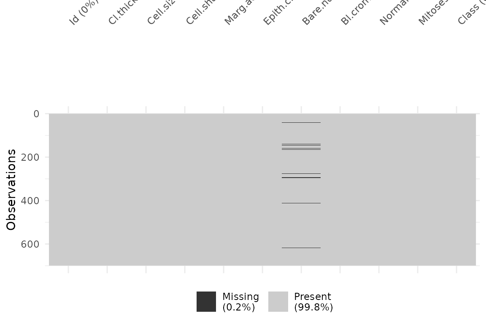

## 2. Impute missing data

``` r

bc_for_impute <- bc_loaded[, setdiff(names(bc_loaded), "Id")]
bc_imputed <- tr_impute(bc_for_impute, method = "mice", m = 5)
```

## 3. Fit and compare three engines

``` r

set.seed(7)
n <- nrow(bc_imputed)
train_idx <- sample(seq_len(n), size = floor(0.7 * n))

bc_train <- bc_imputed[train_idx, ]
bc_test  <- bc_imputed[-train_idx, ]

bc_model_glm <- tr_fit(bc_train, outcome = "Class", engine = "logistic_reg")
#> Model fitted successfully using engine: logistic_reg
bc_model_rf  <- tr_fit(bc_train, outcome = "Class", engine = "random_forest")
#> Model fitted successfully using engine: random_forest
bc_model_xgb <- tr_fit(bc_train, outcome = "Class", engine = "boost_tree")
#> Model fitted successfully using engine: boost_tree
```

``` r

bc_val_glm <- tr_validate(bc_model_glm, newdata = bc_test)
#> Validation metrics (newdata):
#> # A tibble: 5 × 3
#>   .metric     .estimator .estimate
#>   <chr>       <chr>          <dbl>
#> 1 roc_auc     binary        0.997 
#> 2 sens        binary        0.962 
#> 3 spec        binary        0.970 
#> 4 accuracy    binary        0.967 
#> 5 brier_score binary        0.0231
#> 
#> Confusion Matrix:
#>            Truth
#> Prediction  benign malignant
#>   benign       128         3
#>   malignant      4        75
```

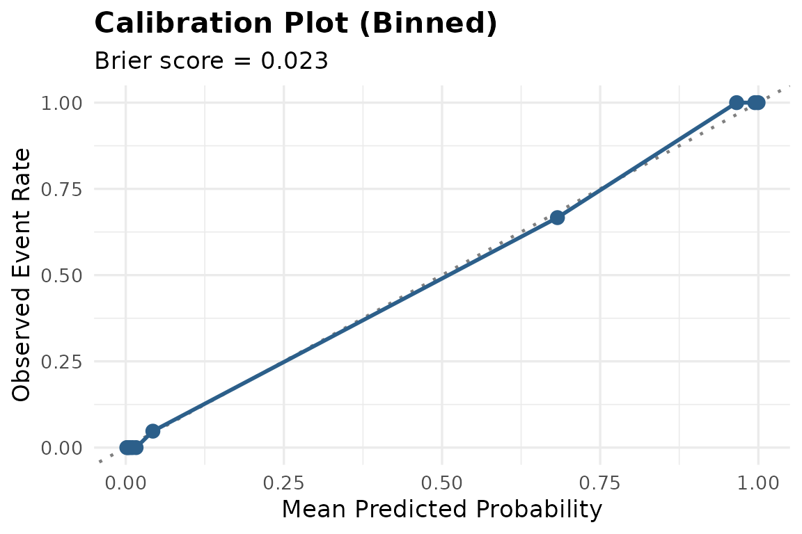

``` r

bc_val_rf  <- tr_validate(bc_model_rf, newdata = bc_test)
#> Validation metrics (newdata):
#> # A tibble: 5 × 3
#>   .metric     .estimator .estimate
#>   <chr>       <chr>          <dbl>
#> 1 roc_auc     binary        0.990 
#> 2 sens        binary        0.987 
#> 3 spec        binary        0.962 
#> 4 accuracy    binary        0.971 
#> 5 brier_score binary        0.0314
#> 
#> Confusion Matrix:
#>            Truth
#> Prediction  benign malignant
#>   benign       127         1
#>   malignant      5        77
```

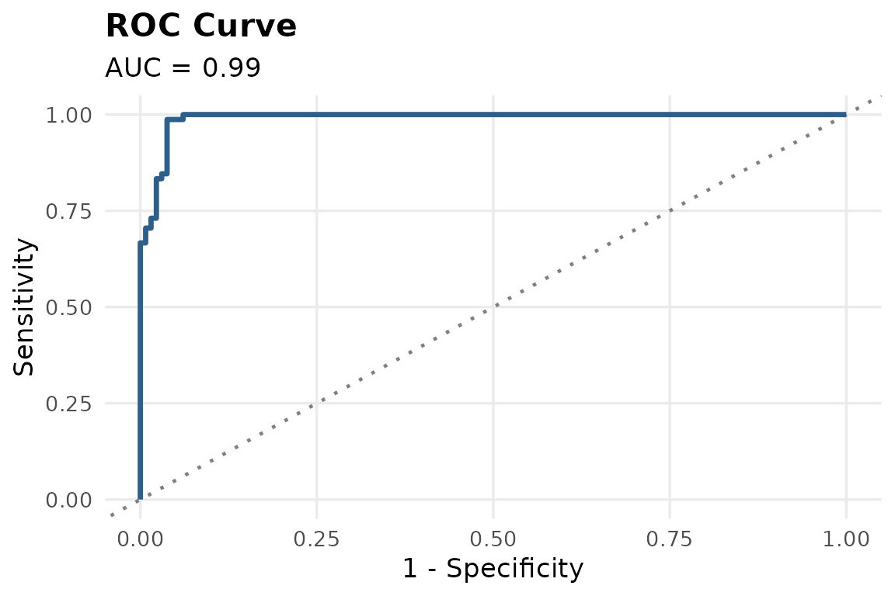

    #> `geom_line()`: Each group consists of only one observation.
    #> ℹ Do you need to adjust the group aesthetic?


``` r

bc_val_xgb <- tr_validate(bc_model_xgb, newdata = bc_test)
#> Validation metrics (newdata):
#> # A tibble: 5 × 3
#>   .metric     .estimator .estimate
#>   <chr>       <chr>          <dbl>
#> 1 roc_auc     binary        0.987 
#> 2 sens        binary        0.962 
#> 3 spec        binary        0.947 
#> 4 accuracy    binary        0.952 
#> 5 brier_score binary        0.0329
#> 
#> Confusion Matrix:
#>            Truth
#> Prediction  benign malignant
#>   benign       125         3
#>   malignant      7        75
```

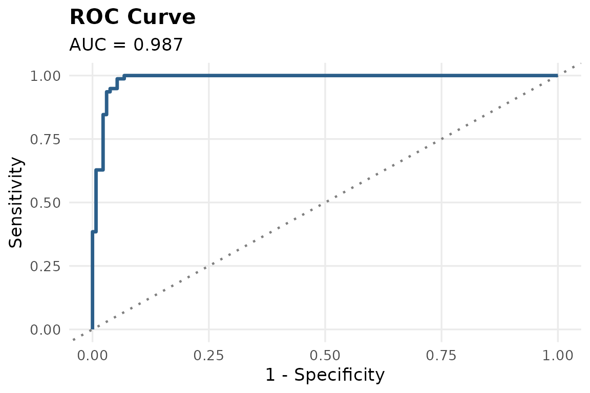

    #> `geom_line()`: Each group consists of only one observation.
    #> ℹ Do you need to adjust the group aesthetic?

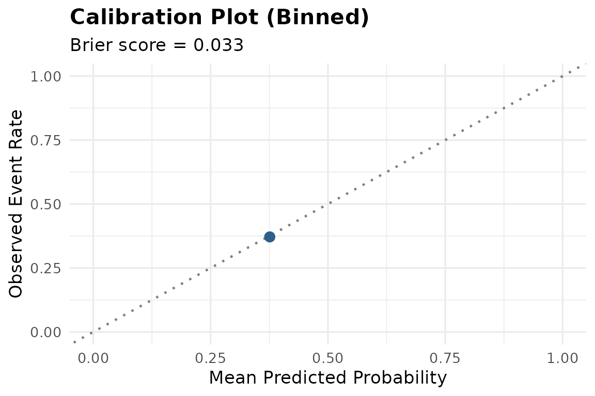

``` r

bc_comparison <- dplyr::bind_rows(
  dplyr::mutate(bc_val_glm$metrics, engine = "logistic_reg"),
  dplyr::mutate(bc_val_rf$metrics, engine = "random_forest"),
  dplyr::mutate(bc_val_xgb$metrics, engine = "boost_tree")
)

tidyr::pivot_wider(bc_comparison, names_from = .metric, values_from = .estimate)
#> # A tibble: 3 × 7
#>   .estimator engine        roc_auc  sens  spec accuracy brier_score
#>   <chr>      <chr>           <dbl> <dbl> <dbl>    <dbl>       <dbl>
#> 1 binary     logistic_reg    0.997 0.962 0.970    0.967      0.0231
#> 2 binary     random_forest   0.990 0.987 0.962    0.971      0.0314
#> 3 binary     boost_tree      0.987 0.962 0.947    0.952      0.0329
```

All three engines perform very well on this dataset (AUC \> 0.98),
reflecting the fact that tumor morphology is highly predictive of
malignancy. Notably, logistic regression performs competitively with the
more flexible tree-based methods, a reminder that added model complexity
does not always yield better clinical performance.

``` r

bc_val_glm$roc_plot
```

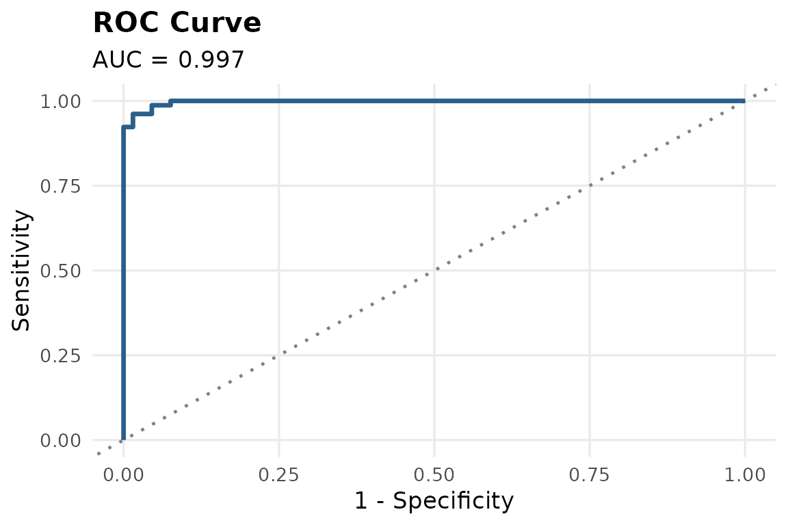

## 4. Explainability

``` r

tr_explain(bc_model_glm, method = "permutation")
#> Warning: Using `size` aesthetic for lines was deprecated in ggplot2 3.4.0.
#> ℹ Please use `linewidth` instead.
#> ℹ The deprecated feature was likely used in the ingredients package.
#>   Please report the issue at
#>   <https://github.com/ModelOriented/ingredients/issues>.
#> This warning is displayed once per session.
#> Call `lifecycle::last_lifecycle_warnings()` to see where this warning was
#> generated.
```

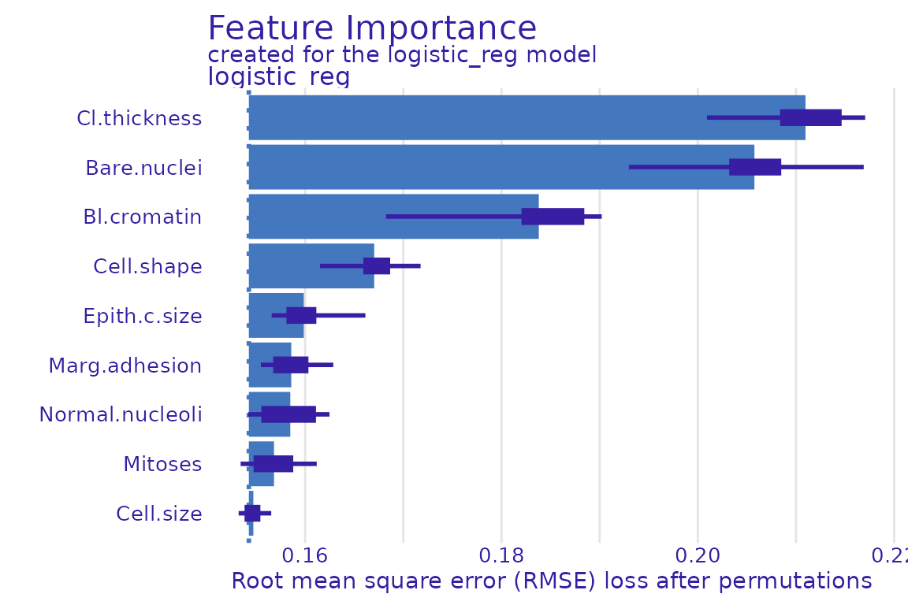

Cell thickness, bare nuclei, and bland chromatin emerge as the strongest
predictors which is consistent with established cytological indicators
of malignancy.

## 5. Automated pipeline review: interpreting the leakage flag

``` r

bc_review <- tr_agent_review(bc_train, bc_model_glm, use_agent = FALSE)
#> 
#> --- triageR Pipeline Review ---
#> [possible_leakage]
#> Predictor 'Cell.shape' alone achieves AUC ~0.97 predicting the outcome. This may indicate data leakage (e.g. the variable is a proxy for or derived from the outcome).
```

[`tr_agent_review()`](https://devwebwacky.github.io/triageR/reference/tr_agent_review.md)
flags `Cell.shape` as a possible leakage concern, since it alone
achieves a high AUC predicting malignancy. **This is an important nuance
to understand**: the check cannot distinguish between genuine, strong
biological signal and true data leakage (e.g. a variable derived from
the outcome itself). In this case, cell shape is a well-established
cytological indicator of malignancy, not a leakage artifact.

This illustrates the intended role of
[`tr_agent_review()`](https://devwebwacky.github.io/triageR/reference/tr_agent_review.md):
it flags statistically unusual patterns for **human review**, not
automatic disqualification. A researcher with domain knowledge can
correctly interpret this flag as expected biological signal rather than
an error.

## 6. Sensitivity analysis

``` r

bc_sensitivity <- tr_sensitivity(bc_train, bc_model_glm)
#> Model fitted successfully using engine: logistic_reg
#> Validation metrics (training_data):
#> # A tibble: 5 × 3
#>   .metric     .estimator .estimate
#>   <chr>       <chr>          <dbl>
#> 1 roc_auc     binary        0.995 
#> 2 sens        binary        0.957 
#> 3 spec        binary        0.979 
#> 4 accuracy    binary        0.971 
#> 5 brier_score binary        0.0238
#> 
#> Confusion Matrix:
#>            Truth
#> Prediction  benign malignant
#>   benign       319         7
#>   malignant      7       156
```

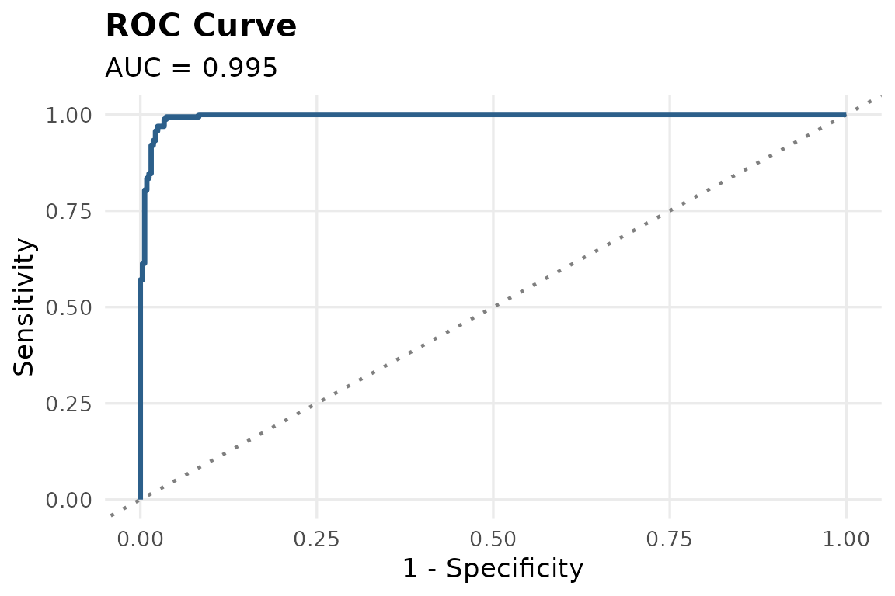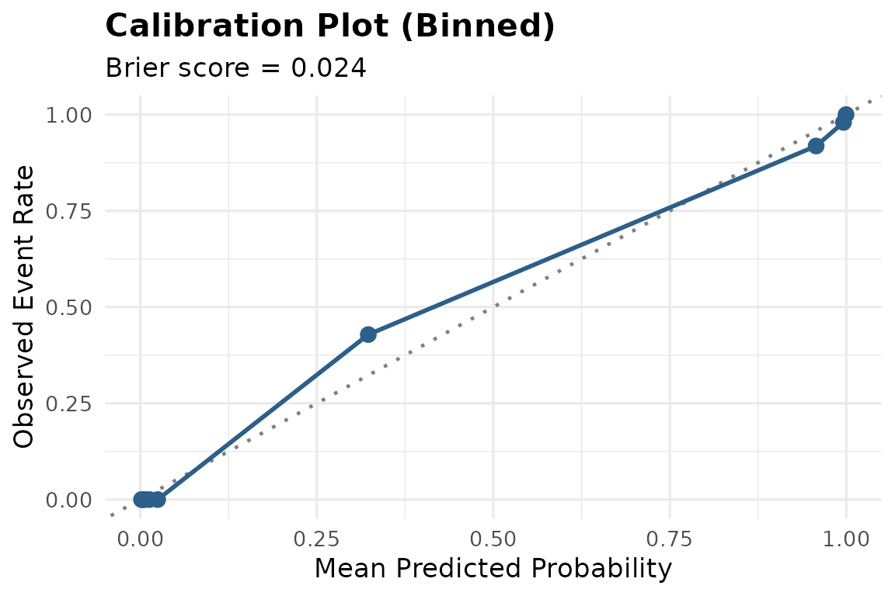

    #> Model fitted successfully using engine: logistic_reg
    #> Validation metrics (training_data):
    #> # A tibble: 5 × 3
    #>   .metric     .estimator .estimate
    #>   <chr>       <chr>          <dbl>
    #> 1 roc_auc     binary        0.994 
    #> 2 sens        binary        0.939 
    #> 3 spec        binary        0.978 
    #> 4 accuracy    binary        0.967 
    #> 5 brier_score binary        0.0246
    #> 
    #> Confusion Matrix:
    #>            Truth
    #> Prediction  benign malignant
    #>   benign       317         8
    #>   malignant      7       124

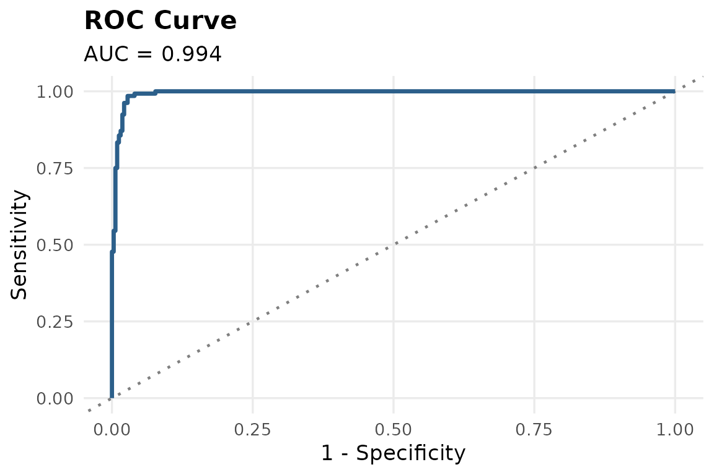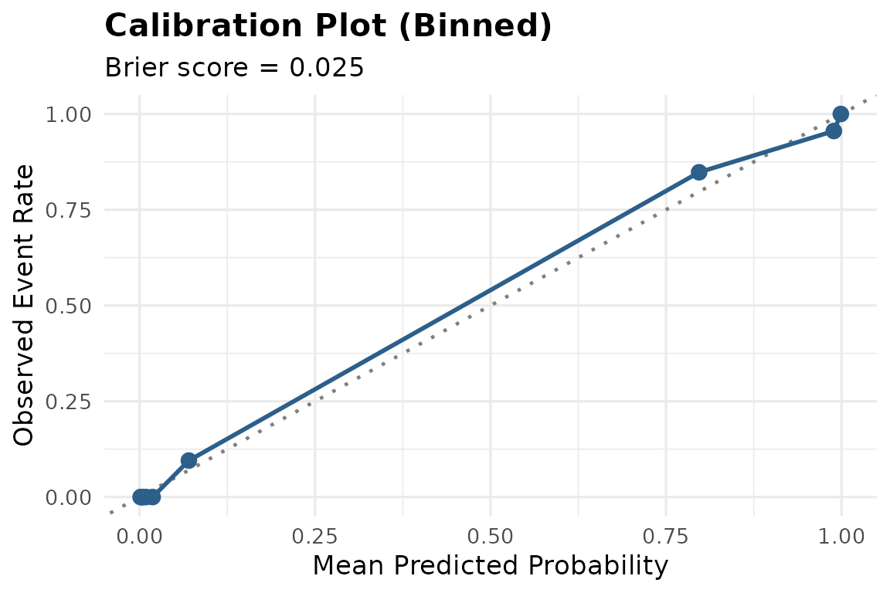

    #> 
    #> --- Sensitivity Analysis Comparison ---
    #> # A tibble: 2 × 7
    #>   scenario          .estimator roc_auc  sens  spec accuracy brier_score
    #>   <chr>             <chr>        <dbl> <dbl> <dbl>    <dbl>       <dbl>
    #> 1 complete_case     binary       0.995 0.957 0.979    0.971      0.0238
    #> 2 outliers_excluded binary       0.994 0.939 0.978    0.967      0.0246
    #> 
    #> Note: Compare AUC/sensitivity/specificity across scenarios. Large swings suggest the model is not robust to that assumption.

Performance remains stable across the complete-case and
outlier-exclusion scenarios, indicating the model is not overly
sensitive to a small number of extreme values or missing-data handling.

## Summary

This case study demonstrated triageR’s three-engine comparison workflow
on a second real-world clinical dataset, and highlighted an important
interpretive nuance in automated pipeline review: statistical flags
require clinical context to interpret correctly. triageR is designed to
surface these patterns for expert review, not to make final judgments
autonomously.
