# Introduction to triageR

## Overview

This vignette walks through a full clinical prediction modelling
workflow using triageR, from raw data to a TRIPOD+AI-aligned report. We
will use the **PIMA Indians Diabetes** dataset, a well-known real-world
clinical dataset, to demonstrate each stage of the pipeline.

## 1. Load and prepare data

The PIMA dataset has a known data quality issue: several clinical
measurements use `0` to represent a missing value, which we know is
physiologically impossible for variables like blood pressure or BMI. We
convert these to proper `NA`s before proceeding, this is a good example
of the kind of cleaning
[`tr_load_clinical()`](https://devwebwacky.github.io/triageR/reference/tr_load_clinical.md)
expects to receive data after.

``` r

if (!requireNamespace("MASS", quietly = TRUE)) {
  knitr::opts_chunk$set(eval = FALSE)
}
library(MASS)
pima <- Pima.tr2
pima$id <- seq_len(nrow(pima))

pima_loaded <- tr_load_clinical(pima, id_col = "id")
pima_loaded
#> # A tibble: 300 × 9
#>    npreg   glu    bp  skin   bmi   ped   age type     id
#>    <int> <int> <int> <int> <dbl> <dbl> <int> <fct> <int>
#>  1     5    86    68    28  30.2 0.364    24 No        1
#>  2     7   195    70    33  25.1 0.163    55 Yes       2
#>  3     5    77    82    41  35.8 0.156    35 No        3
#>  4     0   165    76    43  47.9 0.259    26 No        4
#>  5     0   107    60    25  26.4 0.133    23 No        5
#>  6     5    97    76    27  35.6 0.378    52 Yes       6
#>  7     3    83    58    31  34.3 0.336    25 No        7
#>  8     1   193    50    16  25.9 0.655    24 No        8
#>  9     3   142    80    15  32.4 0.2      63 No        9
#> 10     2   128    78    37  43.3 1.22     31 Yes      10
#> # ℹ 290 more rows
```

## 2. Check and handle missing data

``` r

tr_check_missing(pima_loaded)
#> Missing data summary:
#> - 3 of 9 columns have missing values
#> - 300 total rows
#> # A tibble: 9 × 3
#>   column n_missing pct_missing
#>   <chr>      <int>       <dbl>
#> 1 skin          98        32.7
#> 2 bp            13         4.3
#> 3 bmi            3         1  
#> 4 npreg          0         0  
#> 5 glu            0         0  
#> 6 ped            0         0  
#> 7 age            0         0  
#> 8 type           0         0  
#> 9 id             0         0
```

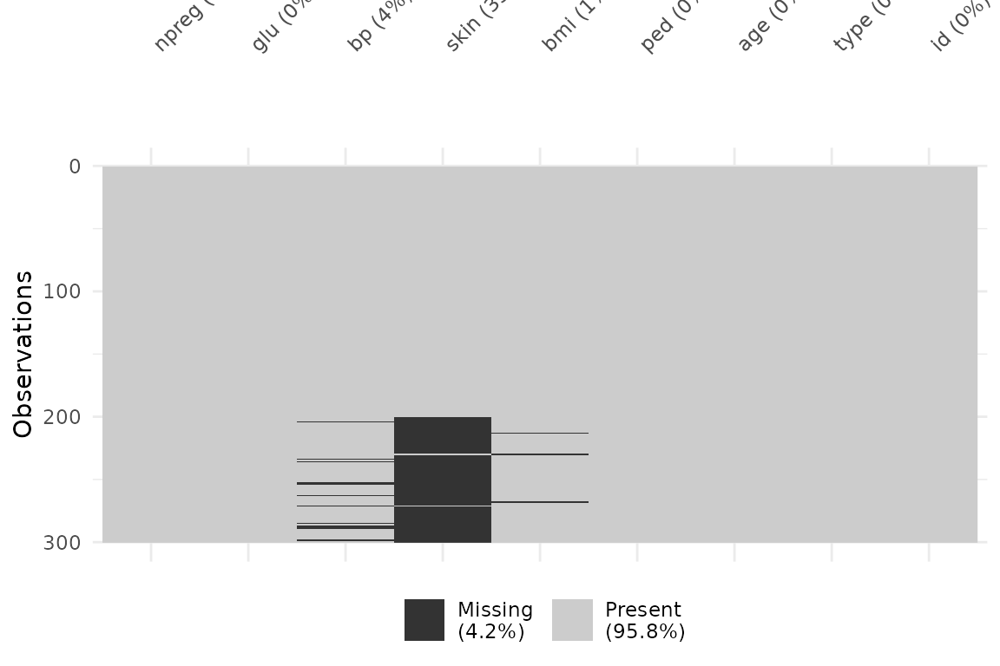

`insulin` and `triceps` show substantial missingness — a realistic
scenario in clinical datasets. We impute using `mice`:

``` r

pima_for_impute <- pima_loaded[, setdiff(names(pima_loaded), "id")]
pima_imputed <- tr_impute(pima_for_impute, method = "mice", m = 5)
```

``` r

sum(is.na(pima_imputed))
#> [1] 0
```

## 3. Fit a model

We split the data into training and test sets, then fit a logistic
regression model.

``` r

set.seed(42)
n <- nrow(pima_imputed)
train_idx <- sample(seq_len(n), size = floor(0.7 * n))

pima_train <- pima_imputed[train_idx, ]
pima_test  <- pima_imputed[-train_idx, ]

pima_model <- tr_fit(pima_train, outcome = "type", engine = "logistic_reg")
#> Model fitted successfully using engine: logistic_reg
```

triageR also supports `"random_forest"` and `"boost_tree"` engines via
the same interface — useful for comparing approaches without rewriting
your pipeline:

``` r

pima_model_rf  <- tr_fit(pima_train, outcome = "type", engine = "random_forest")
#> Model fitted successfully using engine: random_forest
pima_model_xgb <- tr_fit(pima_train, outcome = "type", engine = "boost_tree")
#> Model fitted successfully using engine: boost_tree
```

## 4. Validate the model

Validation on a genuine holdout set produces discrimination metrics, a
confusion matrix, and an ROC curve. We validate all three engines on the
same holdout set to compare performance.

``` r

pima_validation     <- tr_validate(pima_model, newdata = pima_test)
#> Validation metrics (newdata):
#> # A tibble: 5 × 3
#>   .metric     .estimator .estimate
#>   <chr>       <chr>          <dbl>
#> 1 roc_auc     binary         0.873
#> 2 sens        binary         0.742
#> 3 spec        binary         0.797
#> 4 accuracy    binary         0.778
#> 5 brier_score binary         0.142
#> 
#> Confusion Matrix:
#>           Truth
#> Prediction No Yes
#>        No  47   8
#>        Yes 12  23
```

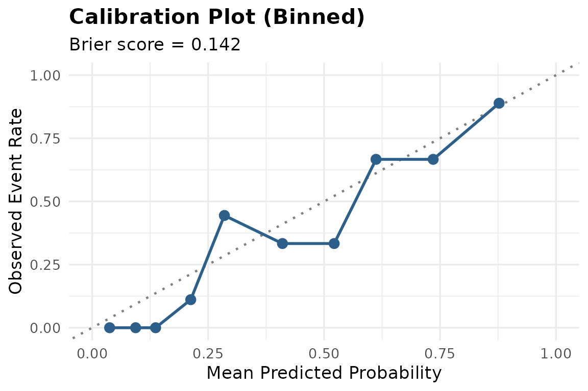

``` r

pima_validation_rf  <- tr_validate(pima_model_rf, newdata = pima_test)
#> Validation metrics (newdata):
#> # A tibble: 5 × 3
#>   .metric     .estimator .estimate
#>   <chr>       <chr>          <dbl>
#> 1 roc_auc     binary         0.858
#> 2 sens        binary         0.774
#> 3 spec        binary         0.831
#> 4 accuracy    binary         0.811
#> 5 brier_score binary         0.151
#> 
#> Confusion Matrix:
#>           Truth
#> Prediction No Yes
#>        No  49   7
#>        Yes 10  24
```

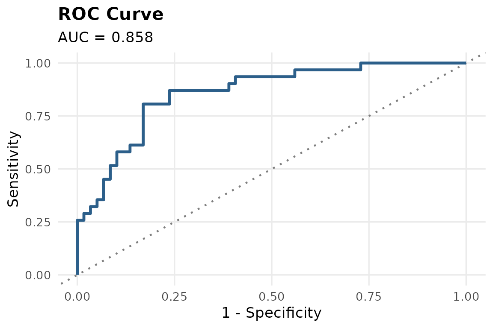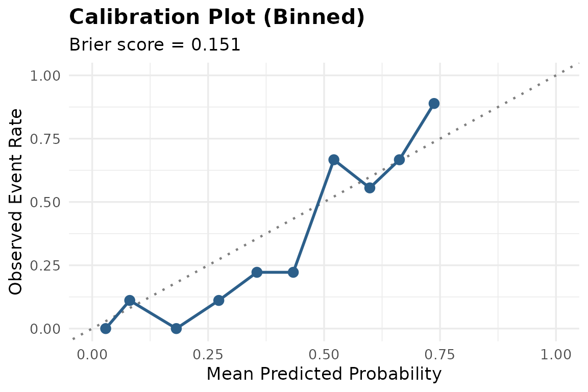

``` r

pima_validation_xgb <- tr_validate(pima_model_xgb, newdata = pima_test)
#> Validation metrics (newdata):
#> # A tibble: 5 × 3
#>   .metric     .estimator .estimate
#>   <chr>       <chr>          <dbl>
#> 1 roc_auc     binary         0.838
#> 2 sens        binary         0.742
#> 3 spec        binary         0.797
#> 4 accuracy    binary         0.778
#> 5 brier_score binary         0.155
#> 
#> Confusion Matrix:
#>           Truth
#> Prediction No Yes
#>        No  47   8
#>        Yes 12  23
```

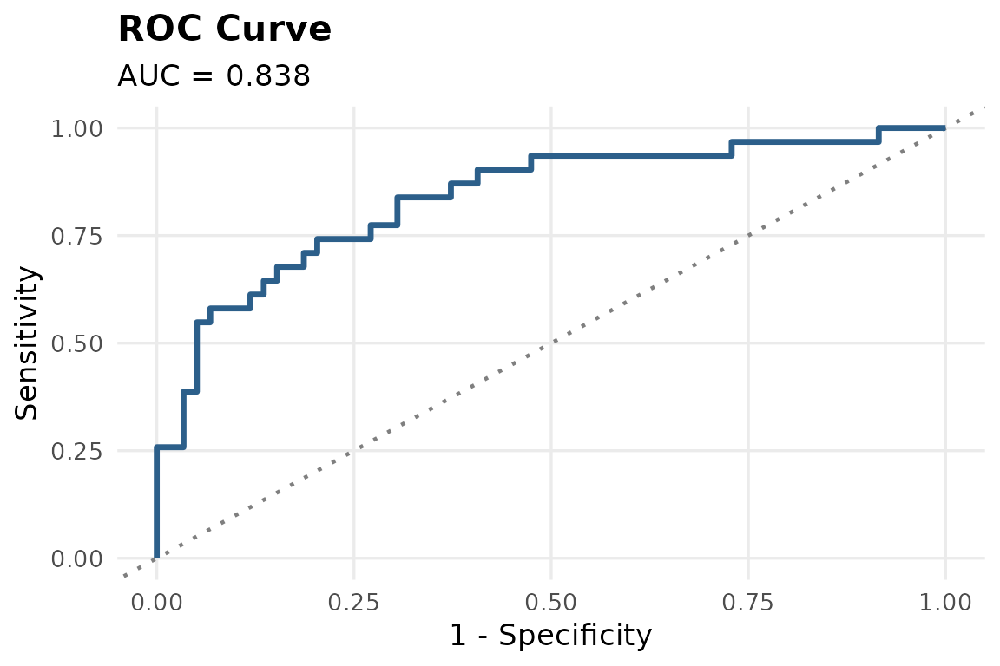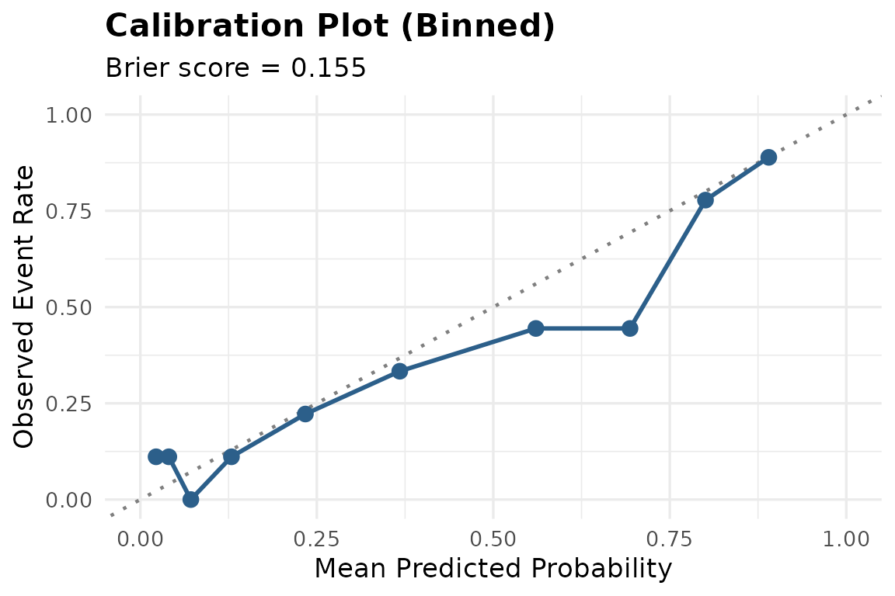

``` r

pima_validation$roc_plot
```

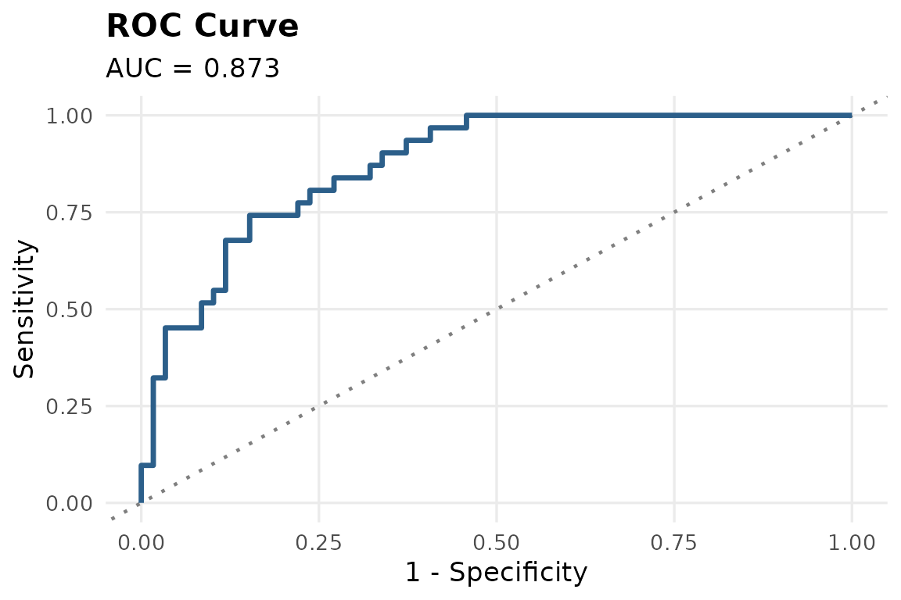

### Comparing engines

``` r

engine_comparison <- dplyr::bind_rows(
  dplyr::mutate(pima_validation$metrics, engine = "logistic_reg"),
  dplyr::mutate(pima_validation_rf$metrics, engine = "random_forest"),
  dplyr::mutate(pima_validation_xgb$metrics, engine = "boost_tree")
)

tidyr::pivot_wider(engine_comparison, names_from = .metric, values_from = .estimate)
#> # A tibble: 3 × 7
#>   .estimator engine        roc_auc  sens  spec accuracy brier_score
#>   <chr>      <chr>           <dbl> <dbl> <dbl>    <dbl>       <dbl>
#> 1 binary     logistic_reg    0.873 0.742 0.797    0.778       0.142
#> 2 binary     random_forest   0.858 0.774 0.831    0.811       0.151
#> 3 binary     boost_tree      0.838 0.742 0.797    0.778       0.155
```

``` r

pima_validation_rf$roc_plot
```


``` r

pima_validation_xgb$roc_plot
```


For the remainder of this vignette, we continue with the logistic
regression model for explainability and reporting, as it offers the most
directly interpretable coefficients for clinical use.

## 5. Explain the model

``` r

tr_explain(pima_model, method = "permutation")
#> Warning: Using `size` aesthetic for lines was deprecated in ggplot2 3.4.0.
#> ℹ Please use `linewidth` instead.
#> ℹ The deprecated feature was likely used in the ingredients package.
#>   Please report the issue at
#>   <https://github.com/ModelOriented/ingredients/issues>.
#> This warning is displayed once per session.
#> Call `lifecycle::last_lifecycle_warnings()` to see where this warning was
#> generated.
```

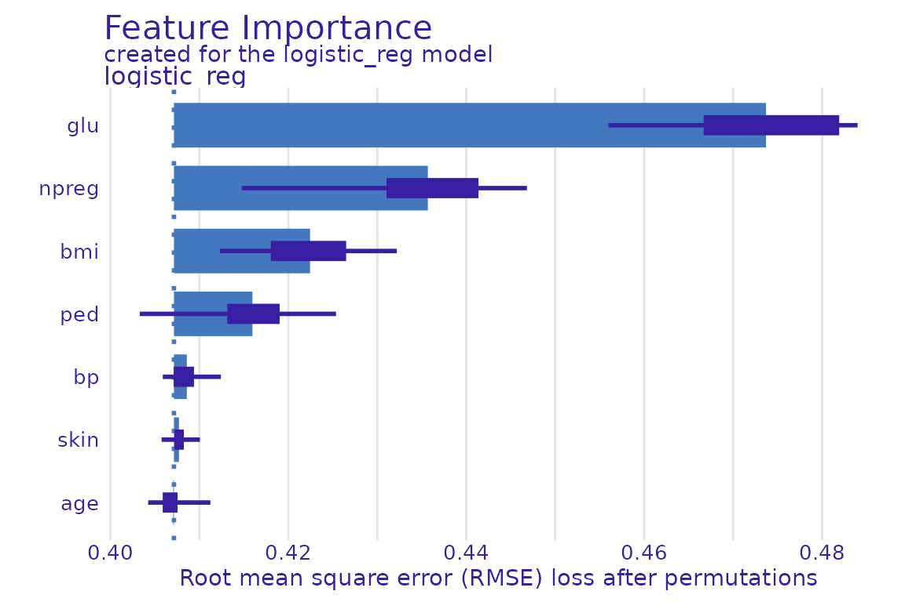

Glucose consistently emerges as the strongest predictor of diabetes in
this dataset, consistent with established clinical literature.

## 6. Automated pipeline review

[`tr_agent_review()`](https://devwebwacky.github.io/triageR/reference/tr_agent_review.md)
checks for common clinical modelling pitfalls: class imbalance, low
events-per-variable ratio, possible data leakage, and small sample size.

``` r

pima_review <- tr_agent_review(pima_train, pima_model, use_agent = FALSE)
#> 
#> --- triageR Pipeline Review ---
#> 
#> No major issues flagged.
```

## 7. Sensitivity analysis

``` r

pima_sensitivity <- tr_sensitivity(pima_train, pima_model)
#> Model fitted successfully using engine: logistic_reg
#> Validation metrics (training_data):
#> # A tibble: 5 × 3
#>   .metric     .estimator .estimate
#>   <chr>       <chr>          <dbl>
#> 1 roc_auc     binary         0.812
#> 2 sens        binary         0.547
#> 3 spec        binary         0.867
#> 4 accuracy    binary         0.752
#> 5 brier_score binary         0.166
#> 
#> Confusion Matrix:
#>           Truth
#> Prediction  No Yes
#>        No  117  34
#>        Yes  18  41
```

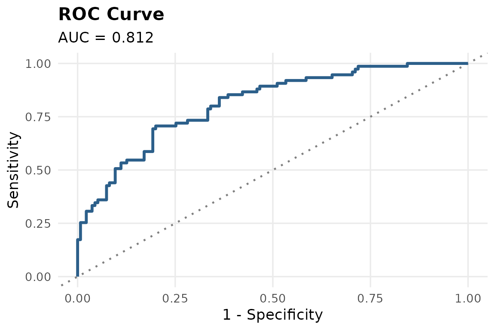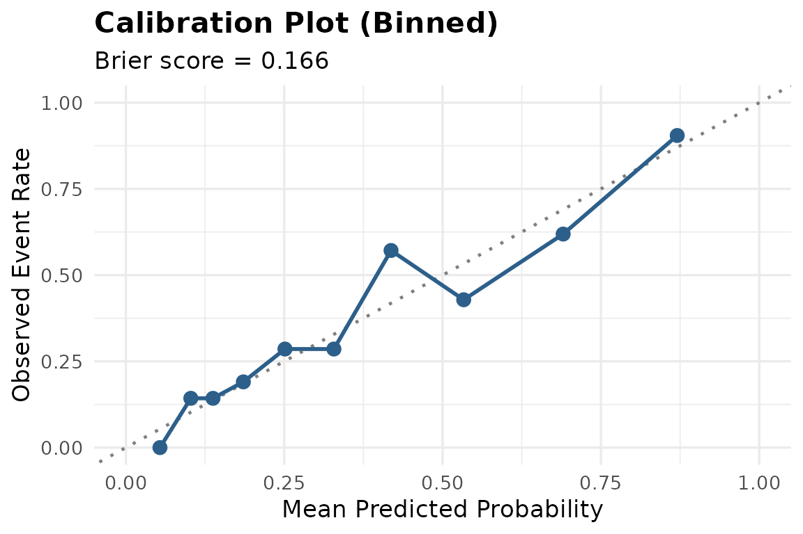

    #> Model fitted successfully using engine: logistic_reg
    #> Validation metrics (training_data):
    #> # A tibble: 5 × 3
    #>   .metric     .estimator .estimate
    #>   <chr>       <chr>          <dbl>
    #> 1 roc_auc     binary         0.809
    #> 2 sens        binary         0.485
    #> 3 spec        binary         0.863
    #> 4 accuracy    binary         0.734
    #> 5 brier_score binary         0.165
    #> 
    #> Confusion Matrix:
    #>           Truth
    #> Prediction  No Yes
    #>        No  113  35
    #>        Yes  18  33

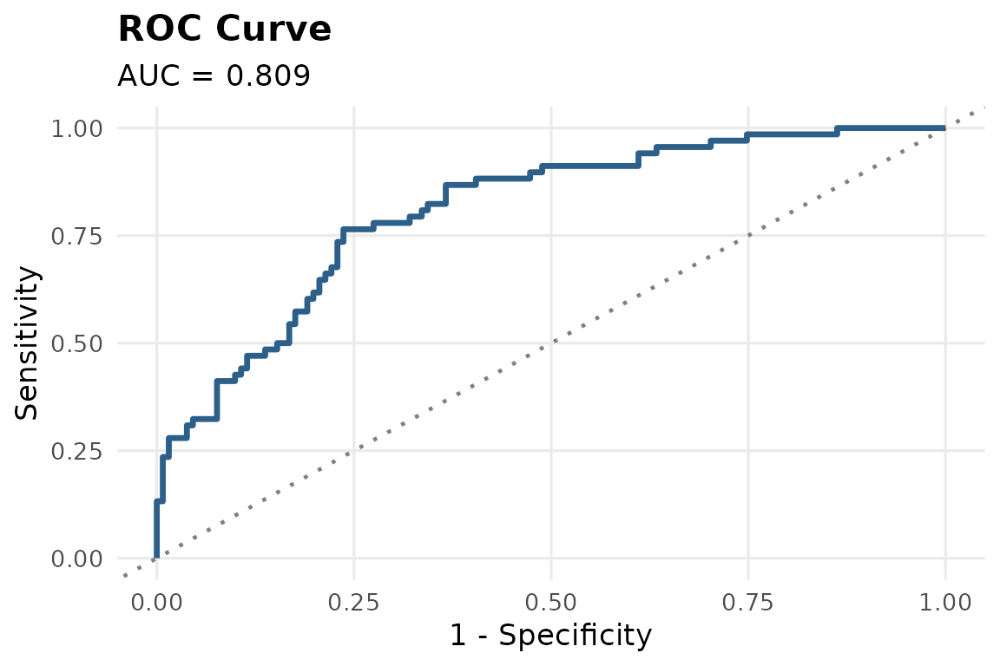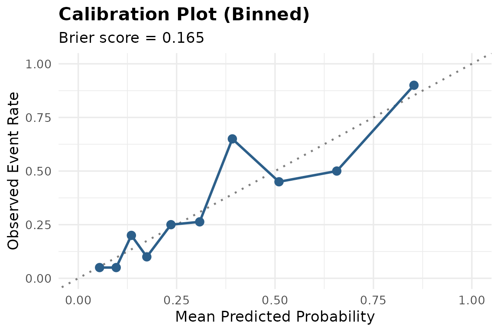

    #> 
    #> --- Sensitivity Analysis Comparison ---
    #> # A tibble: 2 × 7
    #>   scenario          .estimator roc_auc  sens  spec accuracy brier_score
    #>   <chr>             <chr>        <dbl> <dbl> <dbl>    <dbl>       <dbl>
    #> 1 complete_case     binary       0.812 0.547 0.867    0.752       0.166
    #> 2 outliers_excluded binary       0.809 0.485 0.863    0.734       0.165
    #> 
    #> Note: Compare AUC/sensitivity/specificity across scenarios. Large swings suggest the model is not robust to that assumption.

## 8. Generate a TRIPOD+AI-aligned report

Finally, all of the above can be compiled into a single reproducible
report, aligned with TRIPOD+AI reporting guidance.

``` r

tr_tripod_report(
  model = pima_model,
  validation = pima_validation,
  review = pima_review,
  sensitivity = pima_sensitivity,
  output_file = file.path(tempdir(), "pima_diabetes_report"),
  format = "html"
)
```

## Optional: AI-assisted method recommendation

If a Gemini API key is configured (see
[`?tr_recommend_method`](https://devwebwacky.github.io/triageR/reference/tr_recommend_method.md)),
triageR can also suggest an appropriate statistical or ML approach based
on the structure of your data:

``` r

tr_recommend_method(
  pima_train,
  outcome = "type",
  context = "predicting diabetes onset in adult women"
)
```

## Summary

This vignette covered the full triageR workflow: loading and cleaning
clinical data, handling missingness, fitting and validating a model,
explainability, automated pipeline review, sensitivity analysis, and
reproducible reporting, all using a real clinical dataset.
